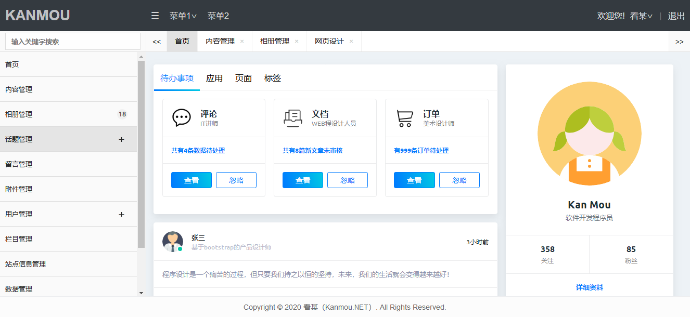

# KanmouAdmin

#### 介绍
看某后台管理模板（KanmouAdmin）,基于jQuery使用Html、css、js开发。框架拥有菜单模糊搜索功能，方便查询自己想要找的菜单，避免一个栏目一个栏目的寻找浪费时间。出此之外，框架根据左侧垂直菜单的点击生成动态Tab菜单，同时生成iframe页面，易操作性强，功能强大，满足大中小型网站后台布局需求。

#### 看某声明

1.  KanmouAdmin为看某个人业余学习研究的作品，欢迎感兴趣者参与贡献，共同研究学习。
2.  KanmouAdmin处于开发调试中，目录结构及代码重构性比较高，所以本仓库暂未放置开源许可协议，在未增加开源许可协议之前，仓库代码仅供学习研究所用。
3.  欢迎各位高手给予赐教，看某在此先谢谢了。

#### KanmouAdmin预览图（2020年2月16日）

